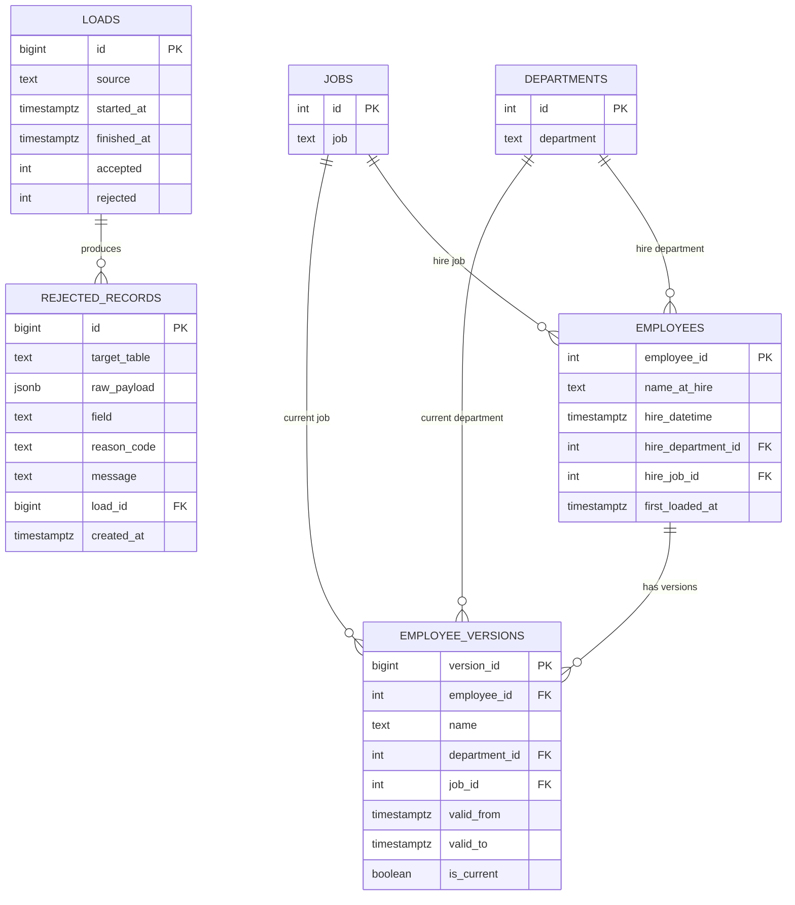

# Data Model

Authoritative schema. Build the SQLAlchemy models and Alembic migrations from this. All
identifiers are the exact names to use in code.

## Entity-relationship



## Reference schema (DDL)

Reference form; adapt to SQLAlchemy + Alembic.

```sql
CREATE TABLE departments (
    id          INTEGER PRIMARY KEY,
    department  TEXT NOT NULL
);

CREATE TABLE jobs (
    id   INTEGER PRIMARY KEY,
    job  TEXT NOT NULL
);

-- Hire facts: one row per employee, immutable after first load.
CREATE TABLE employees (
    employee_id         INTEGER PRIMARY KEY,
    name_at_hire        TEXT NOT NULL,
    hire_datetime       TIMESTAMPTZ NOT NULL,
    hire_department_id  INTEGER NOT NULL REFERENCES departments(id),
    hire_job_id         INTEGER NOT NULL REFERENCES jobs(id),
    first_loaded_at     TIMESTAMPTZ NOT NULL DEFAULT now()
);

-- SCD Type 2: changing attributes over time.
CREATE TABLE employee_versions (
    version_id     BIGINT GENERATED ALWAYS AS IDENTITY PRIMARY KEY,
    employee_id    INTEGER NOT NULL REFERENCES employees(employee_id),
    name           TEXT NOT NULL,
    department_id  INTEGER NOT NULL REFERENCES departments(id),
    job_id         INTEGER NOT NULL REFERENCES jobs(id),
    valid_from     TIMESTAMPTZ NOT NULL,
    valid_to       TIMESTAMPTZ,               -- NULL = open / current
    is_current     BOOLEAN NOT NULL
);
-- At most one current version per employee:
CREATE UNIQUE INDEX ux_employee_versions_current
    ON employee_versions (employee_id) WHERE is_current;

CREATE TABLE loads (
    id           BIGINT GENERATED ALWAYS AS IDENTITY PRIMARY KEY,
    source       TEXT NOT NULL,               -- e.g. 'api:hired_employees', 'historical'
    started_at   TIMESTAMPTZ NOT NULL DEFAULT now(),
    finished_at  TIMESTAMPTZ,
    accepted     INTEGER NOT NULL DEFAULT 0,
    rejected     INTEGER NOT NULL DEFAULT 0
);

CREATE TABLE rejected_records (
    id            BIGINT GENERATED ALWAYS AS IDENTITY PRIMARY KEY,
    target_table  TEXT NOT NULL,              -- 'departments' | 'jobs' | 'hired_employees'
    raw_payload   JSONB NOT NULL,             -- the row exactly as received
    field         TEXT,                       -- which field failed; NULL if record-level
    reason_code   TEXT NOT NULL,
    message       TEXT NOT NULL,
    load_id       BIGINT REFERENCES loads(id),
    created_at    TIMESTAMPTZ NOT NULL DEFAULT now()
);
```

> Use SQLAlchemy identity columns for the `GENERATED ALWAYS AS IDENTITY` primary keys in the migrations.

**Exactly three identity primary keys:** `employee_versions.version_id`, `loads.id`, and
`rejected_records.id`. The other three PKs (`departments.id`, `jobs.id`,
`employees.employee_id`) are plain `INTEGER` business keys supplied by the caller — no
identity/autoincrement, per the "no surrogate for the business key" decision in
`DECISIONS.md`.

## SCD Type 2 logic

Applied when ingesting a **validated** `hired_employees` row:

1. **Employee does not exist** (`employee_id` not in `employees`): insert the hire facts into
   `employees`, and insert the initial row into `employee_versions` with
   `valid_from = hire_datetime`, `valid_to = NULL`, `is_current = true`.
2. **Employee exists:** compare the tracked attributes (`name`, `department_id`, `job_id`) of
   the incoming row against the current version.
   - **Identical:** no-op (idempotent).
   - **Different:** close the current version (`valid_to = now()`, `is_current = false`) and
     insert a new version with the new values, `valid_from = now()`, `valid_to = NULL`,
     `is_current = true`. The `employees` hire facts are left unchanged.

**Hire facts are immutable.** `name_at_hire`, `hire_datetime`, `hire_department_id`,
`hire_job_id` are set on first load and never change. A re-upload with a different
`hire_datetime` for an existing employee is ignored (first load wins). Attribute history is
tracked only in `employee_versions`.

**Reports use hire facts**, not versions: they read `employees` (each employee counted once,
attributed to `hire_department_id` / `hire_job_id`). `employee_versions` exists for analytics
traceability.

## Reference-table ingestion

`departments` and `jobs` are catalogs. Ingestion upserts by `id` (insert, or update the name
if it changed): idempotent and appropriate for reference data. Required fields: `id` (integer)
and the name column.

## Reason codes

Stored in `rejected_records.reason_code`. `field` names the offending column.

| reason_code | field | meaning |
|---|---|---|
| `MISSING_ID` | id | id empty or not an integer |
| `MISSING_NAME` | name / department / job | name column empty |
| `MISSING_DATETIME` | datetime | hire datetime empty |
| `MISSING_DEPARTMENT` | department_id | department_id empty |
| `MISSING_JOB` | job_id | job_id empty |
| `BAD_DATETIME_FORMAT` | datetime | not ISO 8601 with `Z` |
| `UNKNOWN_DEPARTMENT` | department_id | department_id not in `departments` |
| `UNKNOWN_JOB` | job_id | job_id not in `jobs` |

A batch larger than 1000 rows is rejected at the request level with HTTP 422 and is **not**
written to `rejected_records` (it never becomes rows). In the current source data only the
`MISSING_*` codes actually fire, but the full catalog is implemented so future data is
covered.

## Indexes

- `employees (hire_department_id)`, `employees (hire_job_id)`, `employees (hire_datetime)` —
  support the report grouping/filtering and the mart refresh.
- `employee_versions (employee_id)` plus the partial unique index on `is_current`.
- `rejected_records (reason_code)`, `rejected_records (load_id)` — support inspection of
  rejects by reason and by load.

## Materialized views

Defined in `sql/`:

- `report_hires_by_quarter` — `sql/report_1_hires_by_quarter.sql`
- `report_departments_above_average` — `sql/report_2_departments_above_average.sql`

Refresh both at the end of each ingestion load.

## Reference facts about the source data

- Files have no header row, are CRLF, ASCII, comma-separated, no embedded commas.
- Counts: 1999 employees, 12 departments, 183 jobs.
- The only defect type is empty required fields: 70 invalid employee rows, each with exactly
  one empty field. No orphan FKs, no malformed datetimes, no duplicate/zero/negative ids.
- Years present among valid rows: 1643 in 2021, 286 in 2022. The 2022 rows are valid but out
  of scope for the reports (which filter to 2021).
