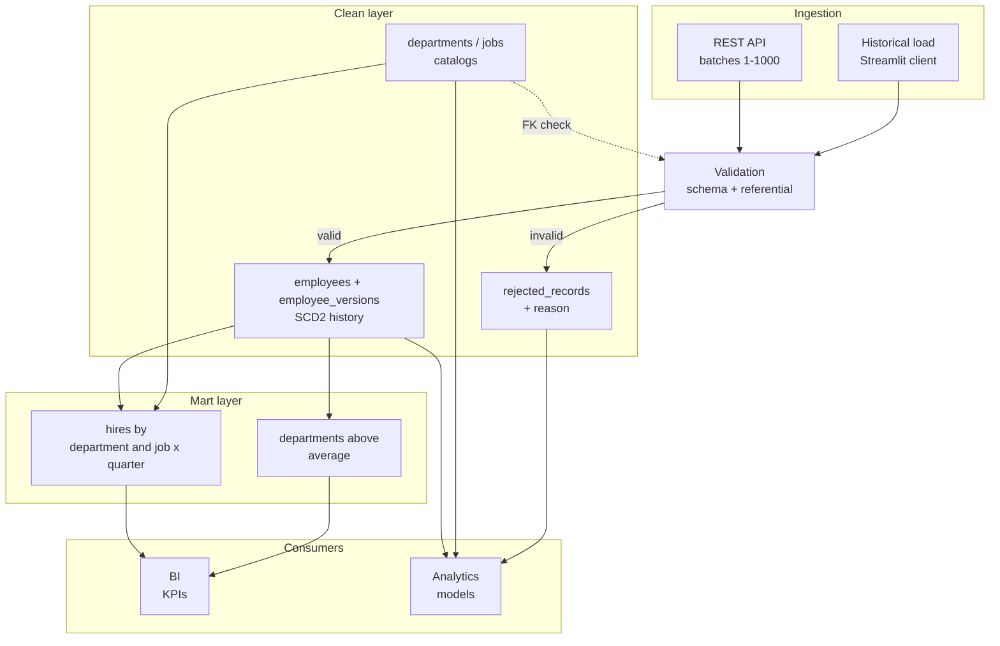
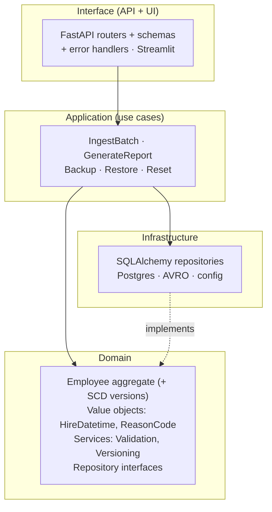
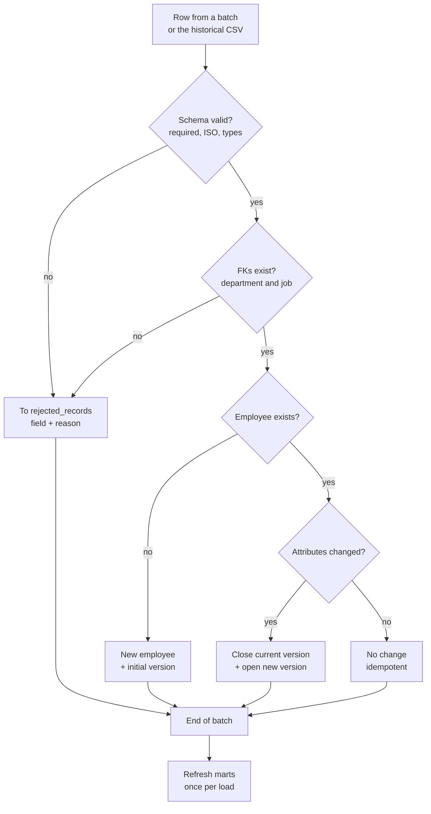
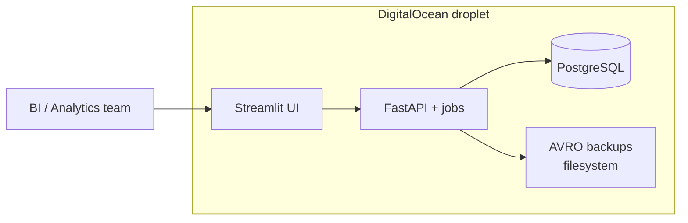

# Design

Architecture and flows for the Hiring Data Platform. For the exact schema see
`DATA_MODEL.md`; for endpoints see `API_CONTRACT.md`.

## Overview

The system has four layers. Ingestion validates incoming rows and splits good from bad. The
clean layer stores the versioned employee history, the reference catalogs, and the rejected
records. The mart layer pre-computes the two reports. Consumers (BI and analytics) read from
the layer that fits them.



## DDD layering

Dependencies point inward. Interface depends on application, application on domain,
infrastructure implements the interfaces the domain defines (dependency inversion). The
domain knows nothing about the database or the API, which keeps it pure and trivial to unit
test.



Folder layout:

```
app/
  domain/            # pure core, no framework dependencies
    employee.py         # Employee aggregate (hire facts) + EmployeeVersion (SCD2)
    reference.py        # Department, Job
    rejected_record.py  # RejectedRecord, Load, LoadStats
    value_objects.py    # HireDatetime, ReasonCode, ...
    validation.py       # validation domain service
    repositories.py     # repository interfaces (ABCs)
  application/        # use cases orchestrating domain + repos
    ingest_batch.py
    generate_report.py
    backup.py
    restore.py
    reset.py            # truncates all six tables + refreshes report views
  infrastructure/
    db/
      models.py         # SQLAlchemy models
      session.py        # engine / sessionmaker construction (Alembic, repos, tests)
      migrations/       # Alembic
      repositories.py   # concrete implementations
    avro/               # backup / restore in AVRO
    config.py
    logging_config.py   # one-shot root logger config, called once at API startup
  interface/
    ingest_constants.py  # MAX_BATCH_SIZE shared by api/schemas.py and ui/historical_load.py
    api/
      main.py           # FastAPI app
      routers/          # ingest.py, reports.py, admin.py
      schemas.py        # request / response (Pydantic)
      errors.py         # exception handlers
    ui/
      streamlit_app.py    # historical load + Admin tab UI (rendering only)
      historical_load.py  # pure orchestration: chunk, POST in order, aggregate
      backup_restore.py   # pure admin-tab orchestration: endpoints, auth, confirmations
tests/
  conftest.py           # DB fixtures: migrated test DB, per-test transaction rollback
  unit/                 # domain and application (no DB)
  integration/          # repos, API (TestClient), AVRO round-trip
docker-entrypoint.sh  # runs `alembic upgrade head` before starting uvicorn
```

Migrations run on container startup via `docker-entrypoint.sh` (not a FastAPI startup hook),
so they execute once per deploy before the app accepts traffic, regardless of uvicorn worker
count.

## Ingestion flow

Each row in a batch is validated and routed independently. Rules: all required fields
present and non-empty, `datetime` in ISO 8601 with `Z`, and `department_id` / `job_id` must
exist in their catalogs. After the whole batch finishes (not per row), the marts are
refreshed once.



The historical load is the same pipeline: the Streamlit client reads the three CSVs, chunks
them into batches of up to 1000, and POSTs to the ingestion endpoints in dependency order
(reference tables before employees). It reuses the exact same validation; there is no blind
bulk path that could insert unvalidated rows.

## Reports (mart layer)

Both reports are materialized views over `employees` (joined to the catalogs for names),
filtered to 2021, refreshed at the end of each load. The columns used for filtering and
grouping are indexed so the reports stay fast as the table grows. The query text, already
verified against the source data, lives in `sql/`.

## Ingestion frequency

The design assumes on-demand batch ingestion: the one-time historical load plus later
manual or periodic uploads. It is not a streaming scenario. Marts refresh at the end of each
load. If cadence ever becomes high-frequency, the only change is moving to incremental or
scheduled refresh; nothing else in the design changes.

## Deployment

Everything runs in containers on the DigitalOcean droplet: the UI, the API with its jobs,
the self-managed PostgreSQL, and the AVRO backups on the filesystem. Set the database
timezone to UTC so quarter bucketing is deterministic.



Deployment is automated: merge to `main` triggers a GitHub Actions workflow that SSHes into
the droplet, resets to `origin/main`, runs `start.sh` (build + compose up), and smoke-tests
the health endpoints behind the Caddy gateway. See `ROADMAP.md`.
