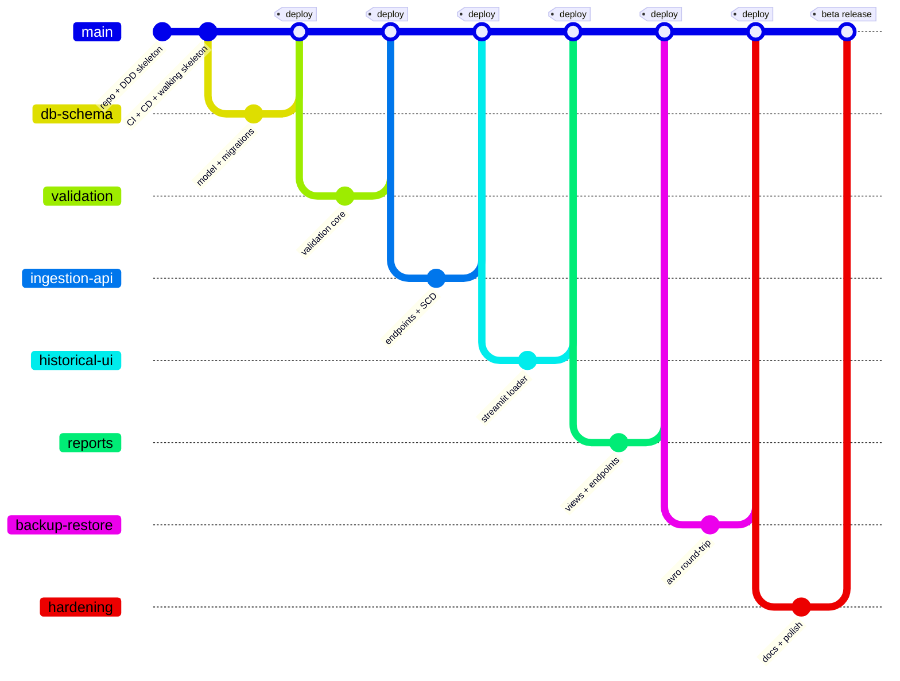
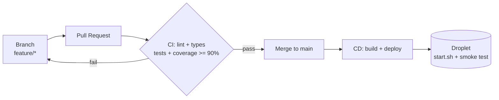

# Roadmap

Build plan by phase and branch. This lets the agent work one branch at a time and know when
each is done.

## Branching model

Trunk-based (GitHub Flow): `main` is the deploy branch and is protected. Each feature lives
on its own branch, enters through a Pull Request with CI green, and merging to `main`
auto-deploys to the droplet. No `develop` or `release` branches (unnecessary ceremony for a
beta with continuous deployment to a single environment).

Branches: `feature/<name>`, `fix/<name>`. Commits: Conventional Commits in English
(`feat(scope): ...`, `fix(scope): ...`, `test: ...`, `docs: ...`, `chore: ...`, `ci: ...`).
`main` rules: PR required, CI green required, at least one review, always deployable.

## CI/CD

Two GitHub Actions workflows.

**`ci.yml` (on every push to a branch and every PR)** — quality gate that blocks the merge:
1. Install dependencies.
2. Lint (ruff) and type-check (mypy).
3. Start a test Postgres (runner service).
4. Run tests (pytest) with a coverage report.
5. Fail if coverage drops below 90%.

**`deploy.yml` (on every push to `main`, plus manual dispatch)** — deploy to the droplet,
following the same pattern as the existing Flowlite deploy on that droplet:
1. Serialized concurrency (`group: deploy-droplet`, `cancel-in-progress: false`): two quick
   merges queue instead of colliding.
2. SSH to the droplet with `appleboy/ssh-action` and the secrets `DROPLET_HOST`,
   `DROPLET_USER`, `DROPLET_SSH_KEY`.
3. On the droplet: `git fetch origin main` + `git reset --hard origin/main` to erase local
   drift.
4. `./start.sh` → build + `docker compose up -d` with the production compose file and its
   `.env.prod`; migrations run on startup.
5. Smoke-test the health endpoints through the Caddy gateway (TLS), retrying up to 5 minutes.
   If unhealthy, mark the deploy red and print `docker compose ps` plus the last logs.

**Walking skeleton:** the first deliverable (phase 0) is a minimal app with a health
endpoint, deployed end to end, so the whole pipeline is proven before any feature is built.

## Quality standard per branch

Every branch, to be mergeable, has: tests added in the same branch (unit for domain and
application, integration for repositories/endpoints/round-trips); coverage ≥ 90% on `app`
(the pure domain should be near 100%; the thin Streamlit layer stays minimal with its logic
extracted and tested separately); error handling for the surface it touches; Alembic
migrations if it changes the schema; lint and types green.

## Phases

### Phase 0 — Foundation and pipeline (`main`)
Repo, empty DDD skeleton, `docker-compose.yml` (Postgres + app), `pyproject.toml`,
`.gitignore`, README stub, and a health endpoint. Add `ci.yml` and `deploy.yml`, protect
`main`, deploy the walking skeleton.
**Done when:** the health check responds on the droplet and the pipeline runs end to end.

### Phase 1 — Schema and model (`feature/db-schema`)
Domain entities and value objects; repository interfaces; SQLAlchemy models and Alembic
migrations for all tables in `DATA_MODEL.md`.
**Tests:** schema creation; repository CRUD against the test DB.

### Phase 2 — Validation core (`feature/validation`)
The validation domain service: required fields, ISO 8601 with `Z`, FK existence, with
rejection and field-level reason codes. Value objects `HireDatetime` and the `ReasonCode`
catalog. This is the heart of the system and where a prior version failed, so it goes solid
with high coverage.
**Tests:** unit tests per rule and edge case (empty, bad format, unknown FK, multiple
defects); near 100% on this part.

### Phase 3 — Ingestion API (`feature/ingestion-api`)
`IngestBatch` use case (validate → persist valid with SCD versioning → log rejected). Routers
`POST /ingest/{table}`, request schemas (list 1–1000), response with accepted/rejected detail,
error handlers. SCD versioning in the Employee aggregate.
**Tests:** endpoint integration; partial success; 1000-row limit (422); idempotency
(identical re-upload = no-op, changed = new version); reject logging.

### Phase 4 — Historical load UI (`feature/historical-ui`)
Streamlit page: upload the three CSVs, chunk into 1000s, POST to the endpoints in dependency
order (catalogs before employees), progress bar counting the calls, accepted/rejected
summary. Orchestration logic extracted into pure functions.
**Tests:** unit tests for chunking and ordering; integration with mocked endpoints.

### Phase 5 — Reports (`feature/reports`)
The two materialized views (migrations) using the verified SQL in `sql/`; refresh triggered
at the end of each load (from the ingestion use case). Routers
`GET /reports/hires-by-quarter` and `GET /reports/departments-above-average`.
**Tests:** the numbers against seeded data (933 combinations and sum 1643; 7 departments);
refresh behavior.

### Phase 6 — Backup and restore (`feature/backup-restore`)
AVRO backup of all tables including `rejected_records`; restore as full replace (truncate +
insert) in reference order. Admin commands (not public endpoints). Adapted from the AVRO lab.
**Tests:** round-trip (backup → wipe → restore → equal); schema fidelity.

### Phase 7 — Hardening and beta release (`feature/hardening`)
Error-handling polish, observability (structured logs, load auditing in `loads`), final
README, Docker tuning, and droplet deploy config (database timezone in UTC for the quarters).
Final coverage pass.
**Done when:** beta deployed, documented, and coverage ≥ 90% across `app`.

## Out of scope (even in the full build)

Streaming ingestion, a managed analytical warehouse, a hiring-rate KPI normalized by
department size, and user/role access control. See `DESIGN.md` for future evolution.
